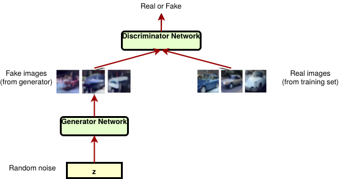

# DCGAN-Fashion-MNIST
Generating synthetic images of FMNIST data using Deep Convolutional Generative Adversarial Networks [DCGAN]

Given a random noisy input generated from a normal distribution of numbers, the model converts these inputs into a new output belonging to one of the category of Fashion MNIST dataset.

## Flow of the Model.

</img>

## Output after epoch = 20

</img>

## Demo gif

</img>
